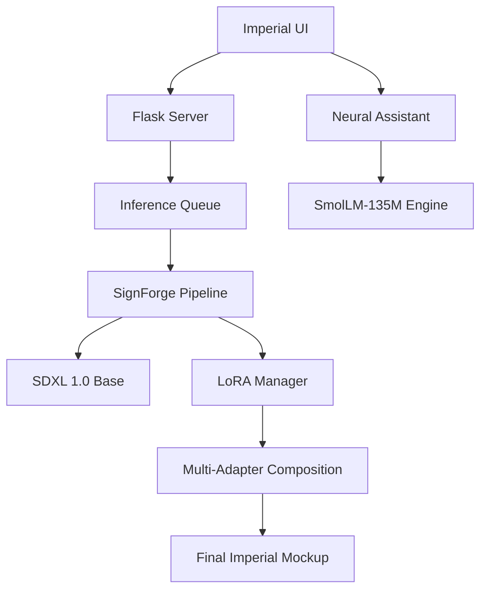

<div align="center">

# 👑 SignForge: The Imperial Mockup Studio

[](https://opensource.org/licenses/MIT)
[](https://www.python.org/downloads/)
[](https://developer.nvidia.com/cuda-toolkit)
[](https://www.docker.com/)
[](/tests)

**Professional-grade Generative AI for Architectural Signage and Brand Visualization.**

[Build Status](#-testing-suite) • [Quick Start](#-quick-start) • [Documentation](#-api-reference) • [Docker](#-docker-deployment)

---

</div>

## 📖 Overview

**SignForge** is a high-fidelity inference engine and design studio built to bridge the gap between flat branding and physical architectural reality. Unlike standard text-to-image models, SignForge utilizes a sophisticated **Multi-LoRA Composition** system and **Image-Conditioned Diffusion** to "forge" realistic signage mockups with precise brand fidelity.

Designed for signage professionals, architects, and high-end branding agencies, it transforms brand assets into immersive visualizations in seconds.

---

## ✨ Key Features

### 🏛️ Imperial UI v2.0
A premium design experience featuring **Champagne Gold & Royal Navy** aesthetics, built with:
- **Elastic Motion Engine**: Spring-physics based animations.
- **Glassmorphism Design**: High-depth, translucent UI components.
- **Hardware Telemetry**: Real-time monitoring of VRAM, CPU, and Queue status.

### 🧬 Advanced Diffusion Engineering
- **Dual-Image Conditioning**: Upload a logo (source) and a facade (target) to guide the forge.
- **Multi-LoRA Stacking**: Combine multiple specialized adapters (Sign Types, Materials, Lighting) in a single generation.
- **Latent Space Optimization**: Native support for `bf16` precision and `xformers` to minimize memory footprint.

### 🛡️ Production Readiness & Intelligence
- **Imperial Neural Assistant**: A built-in, lightweight LLM (`SmolLM-135M`) that acts as a domain expert for signage design and prompt engineering.
- **18 Comprehensive Tests**: Automated Unit, Integration, and E2E coverage.
- **Prometheus Metrics**: Built-in observability for latency, throughput, and system health.
- **Docker Orchestration**: Instant deployment on any system with NVIDIA support.

---

## 🏗️ Project Architecture



---

## 🚀 Quick Start

### 🐳 Docker Deployment (Recommended)
The fastest way to get started on any system. Requires [NVIDIA Container Toolkit](https://docs.nvidia.com/datacenter/cloud-native/container-toolkit/latest/install-guide.html).

```bash
# Clone the repository
git clone https://github.com/your-org/signforge-local.git
cd signforge-local

# Launch the Imperial Studio
docker-compose up -d --build
```
Navigate to `http://localhost:8000` to enter the studio.

### 🛠️ Native Installation
SignForge includes an automated entry point to simplify environment setup:

```powershell
# Windows & Linux
python app.py
```
*This command initializes the virtual environment, installs dependencies, and builds the production frontend.*

---

## 📖 API Reference

SignForge exposes a robust REST API for automation and integration.

### Submit Generation Job
`POST /generate`
```json
{
  "prompt": "Luxury neon sign reading 'ELITE'",
  "logo_image_b64": "data:image/png;base64,...",
  "background_image_b64": "data:image/png;base64,...",
  "adapters": ["sign_type/neon", "material/marble"],
  "steps": 30
}
```

### Conversational Intelligence
`POST /chat`
```json
{
  "message": "What is the best material for a back-lit sign?",
  "history": []
}
```

### System Health & Metrics
- `GET /health`: Detailed hardware and model status.
- `GET /metrics`: Prometheus-formatted metrics output.

---

## 📊 Performance & Requirements

| Metric | Specification |
| :--- | :--- |
| **Minimum VRAM** | 16GB (NVIDIA RTX 3080 or better) |
| **Recommended VRAM** | 24GB (RTX 3090, 4090, or A10G) |
| **Generation Speed** | 5-10 Seconds (GPU) |
| **Storage** | 50GB (Base Model + LoRA Archive) |

---

## 🧪 Testing Suite

SignForge is built with reliability at its core. We maintain a high-coverage test suite:

```bash
# Run all 18 automated tests
python -m pytest tests -v
```

---

## 🤝 Contributing

We welcome contributions from the community! Whether you're adding new sign-type LoRAs or improving the UI motion engine, check out our [Development Guide](CONTRIBUTING.md).

## 📄 License

SignForge is licensed under the **MIT License**. See [LICENSE](LICENSE) for details.

---

<div align="center">
  <sub>Crafted for Royalty by the SignForge Team © 2026.</sub>
</div>
